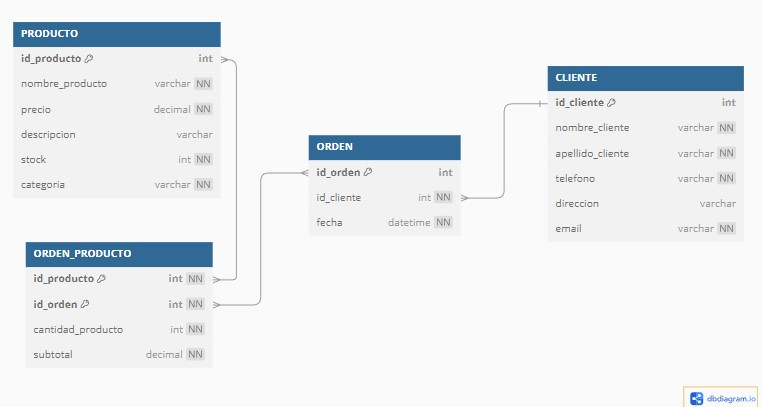
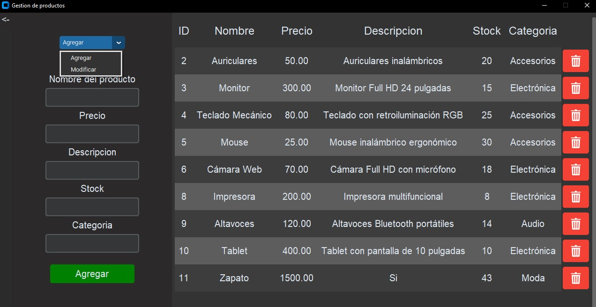

# Explicación de diseño

## Primera forma normal (1NF):

- PRODUCTO: Cada producto tiene su identificador unico id_producto, y nombre_producto, precio, descripcion, stock y categoria contienen valores atómicos.

- CLIENTE: Cada cliente tiene un identificador único id_cliente, y nombre_cliente, apellido_cliente, telefono, direccion y email contienen valores atómicos.

- ORDEN: La tabla de órdenes contiene un identificador único id_orden, una referencia a un cliente con id_cliente, y la columna fecha tiene un valor atómico (la fecha)

- ORDEN_PRODUCTO: Esta tabla es una tabla de relación entre las tablas ORDEN y PRODUCTO. Cada fila contiene un id_orden, un id_producto, la cantidad_producto y el subtotal, todos con valores atómicos.

## Segunda forma normal (2NF):

- Cumple con la primera forma normal

- PRODUCTO: La clave primaria id_producto determina de manera unica las demas columnas (id_producto, precio, descripcion, stock, categoria). No hay dependencias parciales

- CLIENTE: La clave primaria id_cliente determina de manera única las columnas nombre_cliente, apellido_cliente, telefono, direccion y email. No hay dependencias parciales.

- ORDEN: La clave primaria id_orden determina de manera única el id_cliente y la fecha. No hay dependencias parciales.

- ORDEN_PRODUCTO: La clave primaria compuesta id_orden e id_producto determina de manera única cantidad_producto y subtotal. Todos los atributos dependen completamente de la clave primaria compuesta

## Tercera forma normal (3NF):

- Cumple con la segunda forma normal

- PRODUCTO: La tabla PRODUCTO tiene solo atributos relacionados directamente con el id_producto. No hay dependencias transitivas.

- CLIENTE: En la tabla CLIENTE, el id_cliente determina directamente los atributos relacionados con el cliente. No hay dependencias transitivas.

- ORDEN: La tabla ORDEN tiene el id_orden como clave primaria y depende del id_cliente para la relacion. Ademas, la fecha depende directamente del id_orden. No hay dependencias transitivas

- ORDEN_PRDUCTO: En la tabla ORDEN_PRODUCTO, las columnas cantidad y subtotal dependen de la combinacion de id_orden y id_producto. No hay dependencias transitivas

&nbsp;

# Organización del proyecto
## Modulos utilizados
- Pymysql
- Tkinter
- CustomTkinter

## Distribución de archivos:

### Carpeta repositorios:
- Contiene los archivos que se encargan de las consultas específicas de cada sección.

### Carpeta secciones:
- Contiene las distintas partes del proyecto separadas en sus respectivos archivos. Además, utilizamos clases como forma de organizar el código para tener un orden y un mejor manejo de las funciones.

### Carpeta static:
- Guarda las imágenes necesarias para el proyecto.

### Carpeta SQL:
- Contiene los códigos para crear la base de datos, poblarla y generar órdenes aleatorias (dependiendo del stock) entre productos y clientes.

### Menu.py:
- Es el archivo principal que se encarga de conectar todas las secciones del proyecto.

&nbsp;

# Pequeña guía de la app

## La aplicación consiste en un menú principal con elementos para gestionar un sistema de ventas.

---

## Gestión de productos y gestión de clientes cumplen la función de CRUD.

- La pantalla principal del CRUD muestra una lista con los datos cargados (en caso de existir) y permite agregar o eliminar. Cuenta con un menú desplegable que permite cambiar entre la función de agregar y modificar (usando la ID del cliente/producto).

  

  

---

## Procesar órdenes

- Permite ver las órdenes y al hacerles clic abre una ventana con los detalles.  
- Además, permite filtrarlas o eliminarlas según la ID de la orden o la del cliente.

  

  

---

## Búsqueda avanzada

- Permite mostrar productos y clientes, aplicando filtros preestablecidos.  
- Si la lista no tiene filtros aplicados, se puede ordenar la tabla según sus columnas haciendo clic sobre las mismas.

  

  

---

## Producto más vendido

- No necesita explicación, simplemente abre una ventana mostrando el nombre y la cantidad de ventas del producto más vendido.

